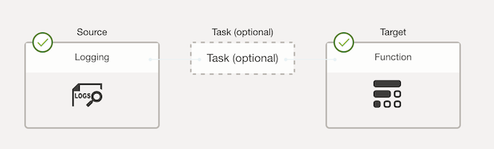

# ga4-oci-adb-analytics


## Prerequisite

1. **Login to OCI and open the OCI Cloud Shell console**

    - **Into the OCI Cloud Shell console**

    

    - **Setup the architecture**
    
    Into the Actions -> Architecture -> select the preferred architecture as x86_64 -> Confirm
    
    
    

2. **Setup the OCI function**

    You can clone the code locally or use the OCI Cloud Shell console to run the code.
    Following the below steps to setup your OCI function environment. (Setup link: https://cloud.oracle.com/functions/apps/ocid1.fnapp.oc1.ap-singapore-1.aaaaaaaarh44z52razt3qkk2vrfjdh3gm3ra45ojynymqv7fvlu6flvilr3q/gettingStarted)


    ```
    fn list contextfn

    fn use context ap-singapore-1fn use context ap-singapore-1

    fn update context oracle.compartment-id ocid1.compartment.oc1..aaaaaaaazkgkbvurmqmdmsbvgfalptpysl5tqbfpwjcu4gsfp3ajmrik6hoq

    fn update context registry sin.ocir.io/ax0s9dy3myes/image-scan

    ...
    ```

3. **Deploy the OCI function**

    ```
    cd image-scan

    fn -v deploy --app image_scan

    ```
    
    The command will automatically generate a docker image and push to your container registry image-scan/image-scan.
    The latest version of the image is `0.0.1`. The version number will auto increase when you deploy the function again.

4. **Setup the connector to retrieve the specific log then trigger OCI function**

    Go to the OCI Logging -> Connector -> Create Connector
    Setup the logging rule that can catch the image object be uploaded to the bucket 'Tbox-Media-Temp'

    

    You can modify the log rule to catch the specific log that you want to trigger the OCI function. For example, the specific prefix of the log, or particular bucket name.

    - **Log query condition example**

    ```
    search "ocid1.compartment.oc1..aaaaaaaazkgkbvurmqmdmsbvgfalptpysl5tqbfpwjcu4gsfp3ajmrik6hoq" |   logContent='*Tbox-Media-Temp*' and data.statusCode='200' and data.message='Object uploaded.'
    ```

    

    - **Function target in connector**

    
